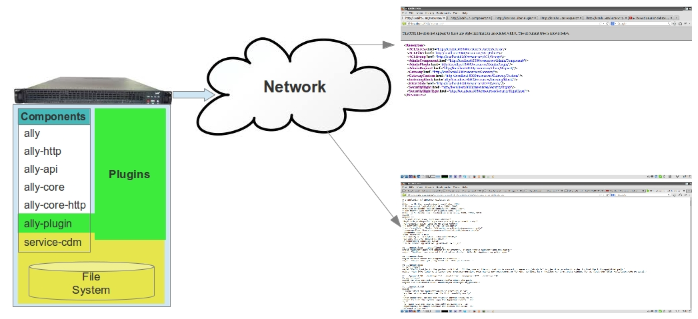
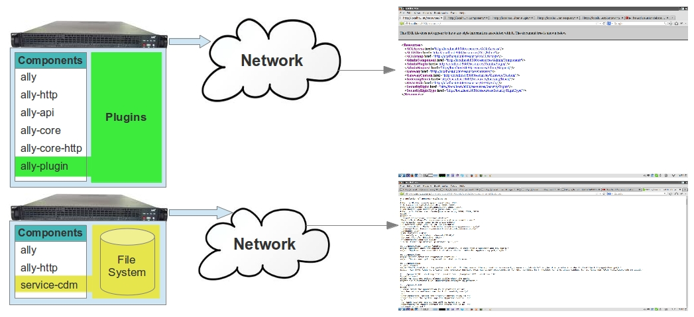
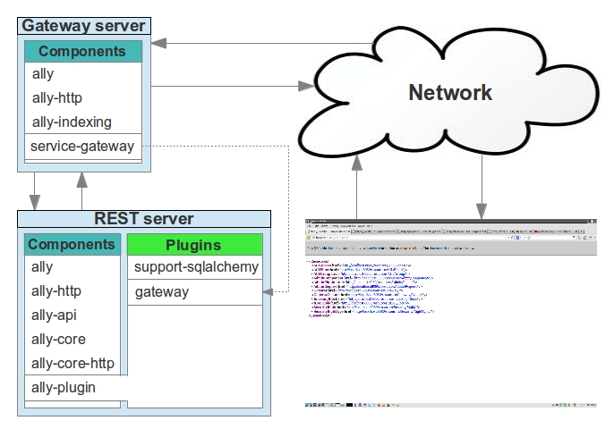
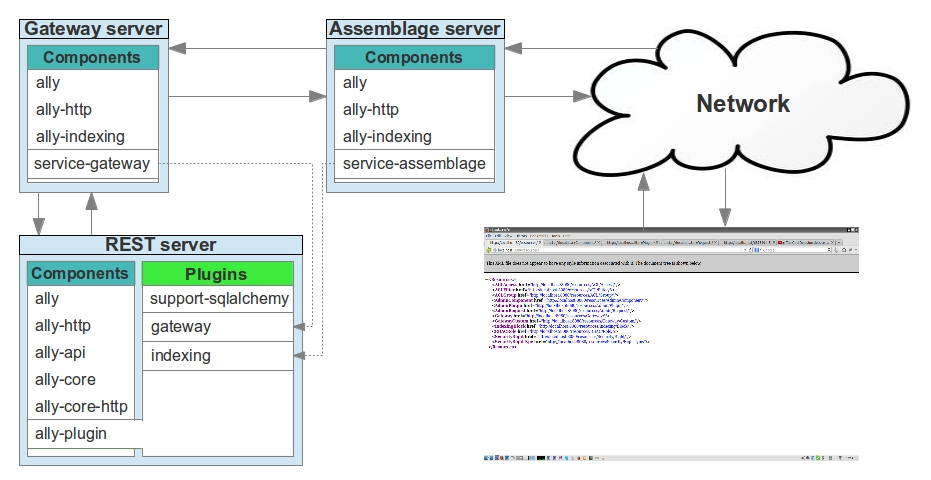

.. _software:

Application Layout
==================

The Ally-Py framework is constructed from components and plugins to facilitate customization. To make the separate parts function as a unified whole, Ally-Py uses Inversion of Control design patterns. The Inversion of Control container, which uses standard python modules instead of XML configuration files, is implemented in the core component ``ally`` in the package ``ally.container``. 

Ally-Py components:

+-------------------------------------+--------------------------------------------------+-----------------------------------------------------------------------------------------------------------------------------+
| Component                           | Depends on                                       | Description                                                                                                                 |
+=====================================+==================================================+=============================================================================================================================+
| ``ally``                            | \-                                               | This is the main component and is the application entry point. It contains the Inversion of Control container.              |
+-------------------------------------+--------------------------------------------------+-----------------------------------------------------------------------------------------------------------------------------+
| ``ally-http``                       | ``ally``                                         | Handles HTTP requests and contains the basic HTTP server.                                                                   |
+-------------------------------------+--------------------------------------------------+-----------------------------------------------------------------------------------------------------------------------------+
| ``ally-http-asyncore-server``       | ``ally-http``                                    | Contains an alternative HTTP server that handles requests in an asynchronous manner using the python ``asyncore`` package.  |
+-------------------------------------+--------------------------------------------------+-----------------------------------------------------------------------------------------------------------------------------+
| ``ally-http-mongrel2-server``       | ``ally-http``                                    | An alternative to the asyncore server with added support for using [0MQ]_ messaging to communicate with a [Mongrel2]_       |
|                                     |                                                  | HTTP server.                                                                                                                |
+-------------------------------------+--------------------------------------------------+-----------------------------------------------------------------------------------------------------------------------------+
| ``ally-plugin``                     | ``ally``                                         | Incorporates plugins into the application.                                                                                  |
+-------------------------------------+--------------------------------------------------+-----------------------------------------------------------------------------------------------------------------------------+
| ``ally-indexing``                   | ``ally``                                         | Provides a vocabulary for understanding index tables in responses. The indexes                                              |
|                                     |                                                  | provide the mechanism for data aggregation by a proxy server and security filtering at a property level.                    |
+-------------------------------------+--------------------------------------------------+-----------------------------------------------------------------------------------------------------------------------------+
| ``ally-api``                        | ``ally``                                         | Provides the means of decorating the [REST]_ models and services.                                                           |
+-------------------------------------+--------------------------------------------------+-----------------------------------------------------------------------------------------------------------------------------+
| ``ally-core``                       | ``ally-api``, ``ally-indexing``                  | Support for handling the API services that have been decorated as [REST]_ services.                                         |
+-------------------------------------+--------------------------------------------------+-----------------------------------------------------------------------------------------------------------------------------+
| ``ally-core-http``                  | ``ally-core``, ``ally-http``                     | This component provides the actual handling for the HTTP [REST]_ by combining the ``ally-core`` and ``ally-http``.          |
+-------------------------------------+--------------------------------------------------+-----------------------------------------------------------------------------------------------------------------------------+
| ``service-assemblage``              | ``ally-http``, ``ally-indexing``                 | Provides the data aggregation service based on the response indexes.                                                        |
+-------------------------------------+--------------------------------------------------+-----------------------------------------------------------------------------------------------------------------------------+
| ``service-gateway``                 | ``ally-http``, ``ally-indexing``                 | Provides the gateway security service.                                                                                      |
+-------------------------------------+--------------------------------------------------+-----------------------------------------------------------------------------------------------------------------------------+
| ``service-cdm``                     | ``ally-http``                                    | Provides content delivery management. [REST]_ models contain references to static files which are streamed by the content   |
|				      |                                                  | delivery management service.                                                                                                |
+-------------------------------------+--------------------------------------------------+-----------------------------------------------------------------------------------------------------------------------------+

Consider the example of a [REST]_ application composed of ``ally``, ``ally-http``, ``ally-api``, ``ally-core``, ``ally-core-http``, ``ally-plugin`` and some custom **plugins**. This is enough to implement simple plugins, and does not require database support, security, data aggregation or content delivery. The following examples show some of the combinations you can deploy applications in multiple ways and  some of which are described in the following examples.

Simple REST Application Example
---------------------------------

.. image:: images/application-rest-base.jpg

This REST application returns REST responses but not media files. To stream static media files add the ``service-cdm`` component to the application.

Simple REST Application with Streaming Example
--------------------------------------------------

Now the REST application returns REST responses and also static media files from the file system. The content delivery management service also streams the application client JavaScript files.

Scalable REST Application Example
--------------------------------------------------

Separating components onto different servers, and replacing the content delivery management by an HTTP streaming server makes Ally-Py scalable. If the application uses [Mongrel2]_, the content is delivered directly by the [Mongrel2]_ server rather than the content delivery management service.

Component separation and use of different combinations of plugins lets Ally-Py be deployed to small application environments and to enterprise environments:

* Delivery of the application as an easy to install single python application with no external dependencies for use in a low traffic environment. 
* Delivery of a scalable application where you can easily separate the content delivery service, proxy server and [REST]_ server. 

.. If we use [0MQ]_ as the application messaging service with [Mongrel2]_ as the server we can start as many application instances as we need depending on the traffic since the RESTful server is stateless.
.. TODO:: 
	Is this important? 

Plugin Overview
--------------------------------

Plugins that provide REST responses depend on ``ally-api``. Other core plugins used by the proxy services ``service-assemblage`` and ``service-gateway`` are described in the following table:

+-------------------------------------+--------------------------------------------------+-----------------------------------------------------------------------------------------------------------------------------+
| Plugin                              | Depends on                                       | Description                                                                                                                 |
+=====================================+==================================================+=============================================================================================================================+
| ``support-sqlalchemy``              | ``ally-api``                                     | Provides SQL Alchemy object relational mapping to REST models and transaction handling per request.                         |
|                                     |                                                  | It can be configured to use one database or multiple databases.                                                             |
+-------------------------------------+--------------------------------------------------+-----------------------------------------------------------------------------------------------------------------------------+
| ``gateway``                         | ``support-sqlalchemy``                           | Provides the Gateway API and configuration, for instance allowing a specific IP address full access to REST models.         |
|                                     |                                                  | Any type of URL or rule can be used in this configuration.                                                                  |
+-------------------------------------+--------------------------------------------------+-----------------------------------------------------------------------------------------------------------------------------+
| ``gateway-acl``                     | ``gateway``, \[``ally-core-http``\]              | Provides access control based on published REST models.                                                                     |
+-------------------------------------+--------------------------------------------------+-----------------------------------------------------------------------------------------------------------------------------+
| ``indexing``                        | ``ally-api``, \[``ally-core``\]                  | Provides the Indexing API and the REST models content response                                                              |
+-------------------------------------+--------------------------------------------------+-----------------------------------------------------------------------------------------------------------------------------+

For instance ``service-gateway`` needs to know what URLs are allowed anonymous access and which URLs are allowed login access, this information is provided also through a RESTful service:

* The ``service-gateway`` fetches a list of gateways allowed anonymous access from the RESTful server. All incoming requests are checked against the list of allowed gateways. 
*  In case of user based access the process also involves an authentication of the user with the REST server, based on this process the client receives a session id that the gateway will then recognize. The REST server also provides a list of gateways based on a session id. Even though the REST server (actually the security plugin) stores and manages the session id it never acts on it, like restricting information or providing other data based on this. Actually the security plugin is like a normal plugin is just that his API is recognized and can be used by the gateway service. 

Separate Gateway Example
----------------------------------------

The gateway service can be implemented as any external application that compares the list of allowed gateways provided by the REST server.

The following image shows a distribution layout composed of two web servers:
* a gateway proxy that validates the authorization for a certain resource based on information provided by the gateway core plugin
* the REST server. 

Indexing Example
--------------------------

This example shows the ``indexing`` plugin and a data aggregation web server (assemblage) for the REST models.  The data aggregation server gathers data from the indexing API objects, this request usually by passes the gateway since we might not want to allow external access to the indexing API. Data aggregation requests go to the gateway server and then to the REST server.

What is data aggregation?
---------------------------

When you create a REST web server you need to separate the REST models correctly.  For instance if you have a *User* resource model that contains data directly related to the user like *Name*, *Phone*, *Email* and you need an icon to be associate with it also.  If you just add a new property *Icon* to the *User* model containing an image URL, and resize it dynamically when it is requested you decrease performance when the application scales. If you have a media archive that supplies predefined sizes you do not have a scaling problem, but you do increase the total number of requests, one for the model, another for the icon information and a third for the icon. The solution is to aggregate the information using an ``X-Filter`` header to request the icon information in the same request as the *User*. 

.. TODO:: 
	**ally-py** is a great framework that provides specific rules on how to implement plugins and imposes a certain discipline. Beside the imposed work flow it also provides great support for breaking the application in layers that can be optimized for great performance and scalability. There are a lot of plugins that can be used of the shelf, for instance the internationalization support or graphical user interface plugins that help a lot in using as a REST client the JavaScript. There are plugins for configuring security based on roles and users, support for media archive ...  The plugins have more then 90% of the code using [SQLAlchemy]_ so writing plugins is very easy.

.. [IoC] Inversion of control, an overview http://en.wikipedia.org/wiki/Inversion_of_control, also a nice presentation http://martinfowler.com/articles/injection.html.
.. [REST] Representational state transfer, http://en.wikipedia.org/wiki/Representational_state_transfer.
.. [0MQ] Zero MQ, http://zeromq.org/
.. [Mongrel2] Mongrel2, http://mongrel2.org/
.. [SQLAlchemy] SQL Alchemy, http://www.sqlalchemy.org/
