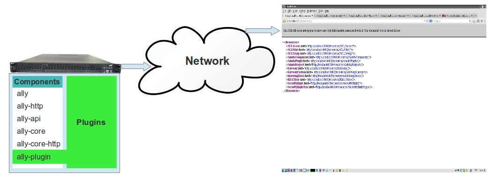

.. _software:

Application Layout
==================

The all-py framework is constructed from components and plugins in order to allow for a flexible and well organized customization of features.
The first problem in having an application formed of smaller parts like in our case the components and plugins is how you can bring them toghether to function as one, in this respect
we use the inversion of control [IoC]_ pattern. To handel the [IoC]_ we created a container that handles this, the implementation is found in the core component ``ally`` in package
``ally.container``. A general aproach in [IoC]_ is to use XML configuration files, but this container is designed to be used with standared python modules.

Lets have a view over the major components of the framework.

======================================  =================================================  ======================================================================================================================
Component                               Depends on                                         Description
======================================  =================================================  ======================================================================================================================
``ally``                                                                                   this is the main component and is the application entry point. This component provides also support for inversion of control container. Basically this component contains general support for the application that is not in any way linked with a particular tehnology.
``ally-http``                           ``ally``                                           contains HTTP specific handling for requests and also the basic HTTP server based on the python built in server.
``ally-http-asyncore-server``           ``ally-http``                                      provides an HTTP server substitute for the basic server from ``ally-http`` that handles the requests in an asyncore manner by using the python builtin ``asyncore`` package.  
``ally-http-mongrel2-server``           ``ally-http``                                      simillar to the asyncore server but provides support for using [0MQ]_ messaging in order to comunicate with [Mongrel2]_ HTTP server.
``ally-plugin``                         ``ally``                                           this component handles the plugins and incorporates them in the application.
``ally-indexing``                       ``ally``                                           the indexing is a component that provides the vocabulary for understanding the index table in the responses, the indexes provide the mechanism for data agregation by a proxy server and security filtering at a property level.
``ally-api``                            ``ally``                                           provides the means of decorating the [REST]_ models and services.
``ally-core``                           ``ally-api``, ``ally-indexing``                    provides the general support for handling the [API]_ services that have been decorated as [REST]_ services.
``ally-core-http``                      ``ally-core``, ``ally-http``                       this component provides the actual handling for the HTTP [REST]_ by combining the ``ally-core`` and ``ally-http``.
``service-assemblage``                  ``ally-http``, ``ally-indexing``                   this component provides the data agregation service based on the response indexes.
``service-gateway``                     ``ally-http``, ``ally-indexing``                   this component provides the gateway security service.
``service-cdm``                         ``ally-http``                                      this component provide the content delivery management, basically the static resources streaming since [REST]_ is only for models, usually the REST models will have references to static files, like media files and the CDM is used for delivery them.
======================================  =================================================  ======================================================================================================================

So what is the reasoning of splitig the application in this components, the most important aspect is the fact that the application deployment can be done in multiple ways.

Lets consider the application [REST]_ base composed of ``ally``, ``ally-http``, ``ally-api``, ``ally-core``, ``ally-core-http``, ``ally-plugin`` and **plugins**, this combination provides the base for a [REST]_ application that allows us to implement
simple plugins with no support for database support, security, data aggregation or content delivery. As it can be seen for a [REST]_ server we don't need all the components.

So we have web application that is able to provide [REST]_ type model responses, this is great but usually not enought for a complex web application, we need more.
Lets consider a REST model designed to provide internationalization support that will provide references for [PO]_ files, in this case we also need someone to stream the [PO]_ file.
The [REST]_ server is not designed to do that, it is designed to provide only [REST]_ models. So in order to solve this we have the ``service-cdm`` component to stream static files.

.. image:: images/application-rest-cdm.jpg

In this purpose we have the core plugins, as a general rule this plugins are not mandatory for the application but if you whant to use the service components
(here I am refering to ``service-assemblage``, ``service-gateway``)

Lets have a view over the major core plugins of the framework.

======================================  =================================================  ======================================================================================================================
Plugin                                  Depends on                                         Description
======================================  =================================================  ======================================================================================================================
``support-sqlalchemy``                  ``ally-api``                                       the [SQLAlchemy]_ support plugin.
``gateway``                             ``support-sqlalchemy``                             the 
======================================  =================================================  ======================================================================================================================

.. [IoC] Inversion of control, an overview http://en.wikipedia.org/wiki/Inversion_of_control, also a nice presentation http://martinfowler.com/articles/injection.html.
.. [REST] Representational state transfer, http://en.wikipedia.org/wiki/Representational_state_transfer.
.. [API] Application programming interface, http://en.wikipedia.org/wiki/Application_programming_interface.
.. [0MQ] Zero MQ, http://zeromq.org/
.. [Mongrel2] Mongrel2, http://mongrel2.org/
.. [SQLAlchemy] SQL Alchemy, http://www.sqlalchemy.org/
.. [PO] Gettext, http://en.wikipedia.org/wiki/Gettext